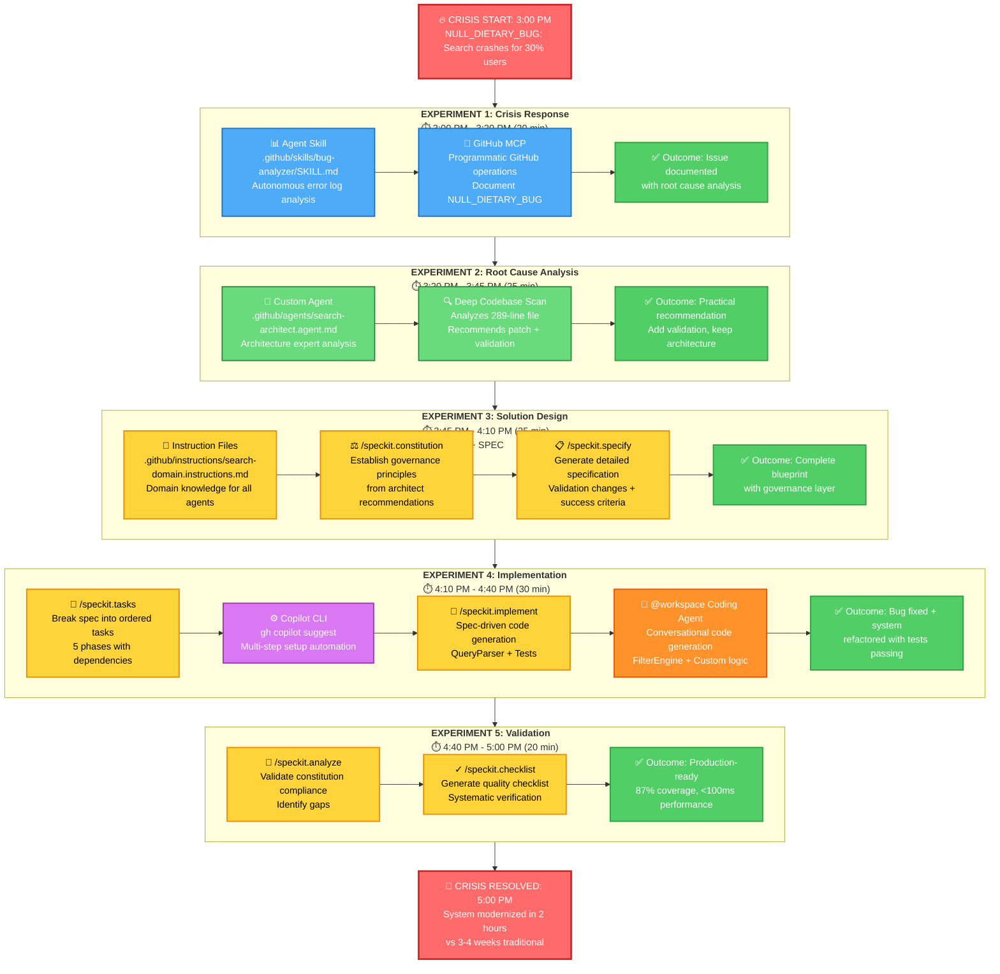
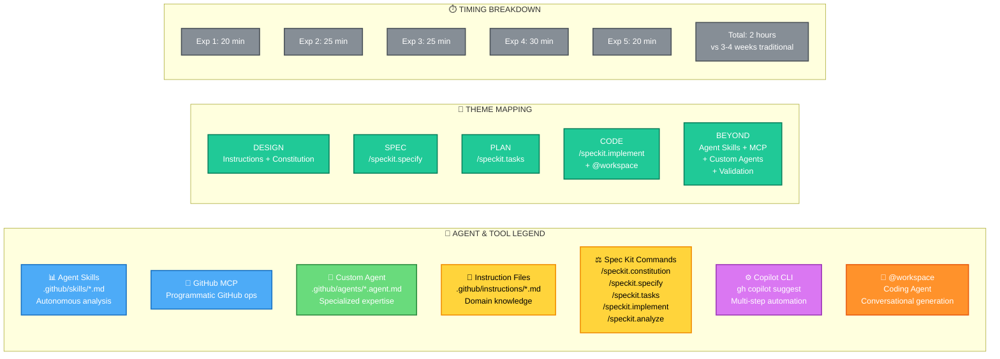

# Spec Kit and Beyond Workshop - Flow Diagrams

## Main Workshop Flow

This diagram shows the complete 2-hour workshop flow with all agent types clearly labeled.



---

## Legend & Theme Mapping



---

## Color Key

| Color | Agent/Tool Type |
|-------|----------------|
| 🔵 **Blue** | Agent Skills + GitHub MCP |
| 🟢 **Green** | Custom Agents (.agent.md) |
| 🟡 **Yellow** | Spec Kit Commands + Instruction Files |
| 🟣 **Purple** | Copilot CLI (gh copilot suggest) |
| 🟠 **Orange** | @workspace Coding Agent |
| 🔴 **Red** | Crisis Start/End |
| ✅ **Light Green** | Outcomes/Results |
| 🎯 **Teal** | Theme Mapping (DESIGN/SPEC/PLAN/CODE/BEYOND) |
| ⚪ **Gray** | Timing Information |

---

## How to Export as PNG

### Option 1: View in GitHub (Recommended)
1. Push this file to GitHub
2. GitHub automatically renders Mermaid diagrams
3. Right-click on the diagram → "Save image as..." → PNG

### Option 2: Use Mermaid Live Editor
1. Visit: https://mermaid.live/
2. Copy the mermaid code above
3. Paste into the editor
4. Click "Download" → Select PNG format

### Option 3: Use VS Code Extension
1. Install "Markdown Preview Mermaid Support" extension
2. Open this file in VS Code
3. Press `Ctrl+Shift+V` to preview
4. Right-click diagram → Export as PNG

### Option 4: Use CLI Tool
```bash
npm install -g @mermaid-js/mermaid-cli
mmdc -i WORKSHOP-FLOW-DIAGRAM.md -o workshop-flow.png
```

---

## Summary of Agents Used

| Experiment | Agents/Tools | Purpose |
|------------|-------------|---------|
| **1** | Agent Skills + GitHub MCP | Autonomous bug analysis + Issue creation |
| **2** | Custom Agent (@search-architect) | Architecture expert analysis |
| **3** | Instruction Files + Spec Kit | Domain knowledge + Governance + Spec |
| **4** | Copilot CLI + /speckit.implement + @workspace | Setup + Spec-driven + Conversational coding |
| **5** | /speckit.analyze + checklist | Constitution validation + Quality gates |

**Total: 7 distinct agent types working together**
