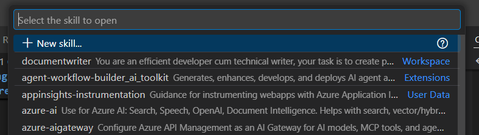
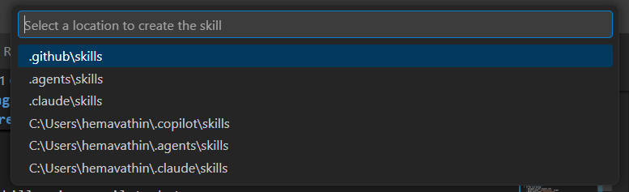

# Exercise 1: Reproduce the Bug

> **Time:** ~8 minutes
> **Standalone:** No prior exercises needed.

## Goal

Run the failing test, read the crash output, and locate the exact line in `search.py` that causes it.

---

## Steps

**1.** Open a terminal and navigate to the recipe-manager folder:

## 📝 Exercise 1.0: Reproduce the Bug (5 min)

### Task
Before analyzing the error, let's reproduce it to get the actual stack trace and understand the problem. Navigate to vscode terminal and clone the forked repository, then run the test script to see the error in action.

### Steps

**1.0.1** Navigate to the recipe-manager folder:
```bash
cd recipe-manager
```

**2.** Run the bug reproduction script:

```bash
python test_bug.py
```

**3.** Read the crash output carefully. Notice which test case crashes and what the error message says.

**4.** Open `recipe-manager/search.py` and jump to **line 447**:

```python
for restriction in user.dietary_restrictions:  # CRASHES IF None!
```

### What You Verified
- ✅ **Bug is real** - Reproducible with test script
- ✅ **Stack trace available** - You now have the error details for analysis
- ✅ **Root cause visible** - Line 447 iterates over None value
- ✅ **Context understood** - Affects users without dietary restrictions (30% of searches)

**💡 Now you have the stack trace and context to give your agent skill!**

---

## 📝 Exercise 1.1: Create Issue Analyzer Skill (6 min)

### Task
Build an agent skill that can analyze errors intelligently.

### Steps

**1.1.1** Create the skill using Copilot Chat UI:

1. Open **GitHub Copilot Chat** 

2. Click the **⚙️ Configure** button (top-right of chat panel)

3. Select **Skills** from the menu

   
   

4. Click **➕ New Skill** button

   
   

5. In the file dialog, select location:

   
   *Choose .github\skills as the location for your skill*
   - Enter skill name: `issue-analyzer`
   - Click Save

**Result:** VS Code creates `.github/skills/issue-analyzer/SKILL.md` automatically

---

**1.1.2** Edit the generated `SKILL.md` file:

Replace the template content with:

```yaml
name: issue-analyzer
description: Expert at diagnosing production errors and identifying code quality gaps, Analyzes stack traces AND scans codebase for infrastructure issues
---

## Your Capabilities

When given error logs or stack traces, you autonomously:
1. **Extract root cause** from stack traces
2. **Scan codebase** for contributing infrastructure issues
   - Missing test infrastructure
   - Unstructured logging
   - Missing type hints
3. **Identify affected files** and line numbers
4. **Assess severity** (critical/high/medium/low)
5. **Estimate impact** (% of users affected)
6. **Suggest immediate hotfix** and long-term solution
7. **Recommend labels** for issue tracking

```
Testing with Alice (has dietary restrictions)...
Search succeeded!

Testing search with user who has dietary_restrictions=None...
CRASH! (This is the NULL_DIETARY_BUG)
Error: 'NoneType' object is not iterable

### What You Created
An agent that thinks like a senior engineer - not just reading errors, but **analyzing root causes and impacts**.

---

## 📝 Exercise 1.2: Invoke the Skill (3 min)

### Task
Use your skill to analyze the production error.

### Steps

**1.2.1** In the terminal where you ran `python test_bug.py`, **select the complete error output (the crash section with stack trace) which sets a context to copilot using #terminalSelection**

**1.2.2** Open Copilot Chat and invoke your skill:
```
Look at #terminalSelection using #file:SKILL.md analyse the production error
```

💡 **What's happening:**
- `#terminalSelection` - Attaches the terminal output you selected
- `#file:SKILL.md` - References your custom skill file
- Copilot reads the SKILL.md and applies its analysis format

### Expected Output (output may vary based on your model's analysis)
```
ANALYSIS COMPLETE

Title: [Search] Null handling error in dietary restrictions filter
Severity: CRITICAL
Root Cause: Line 447 assumes dietary_restrictions is a list, 
            but can be None for users with no preferences set
Affected Files: 
  - search.py:447 (primary failure point)
  - models.py (User model allows None)
  - api/routes.py (calls filter function)

Impact: ~30% of searches (users without dietary preferences)
Users see: 500 Internal Server Error

Immediate Fix: Add null check before line 447
  if user.dietary_restrictions is None:
      user.dietary_restrictions = []

Long-term Fix: Refactor search architecture
  - Add input validation layer
  - Use Pydantic models (defaults to empty list)
  - Separate concerns (parsing vs filtering)

```

### What Just Happened
Your agent **autonomously analyzed** the error, traced it across 3 files, estimated impact, and proposed both quick and proper fixes. Let's assign the Copilot coding agent for the immediate fix and investigate deeper architectural issues for the long-term fix.

---

## 📝 Exercise 1.3: Auto-Create GitHub Issue with Skill Composition (6 min)

### Task 
Create a GitHub issue from the analysis using your skill and GitHub MCP.

### Steps

**1.3.1** Add the GitHub Issues skill from the community library:

GitHub maintains a curated collection of reusable skills. Let's add the official `github-issues` skill:

1. Visit [GitHub's Awesome Copilot Skills Library](https://github.com/github/awesome-copilot/tree/main/skills/github-issues)

   
   *GitHub's official skills library with community-contributed skills*

2. Create the `github-issues` skill folder structure in your repo inside VS Code or terminal with the following command:
   ```bash
   mkdir -p .github/skills/github-issues/references
   ```

3. Copy the official SKILL.md from GitHub:
   - Navigate to the `github-issues` skill in the [Awesome Copilot Skills repository](https://github.com/github/awesome-copilot/blob/main/skills/github-issues/SKILL.md)
   - Click **Raw** button to view the raw markdown
   - Copy the entire content
   - Paste into your `.github/skills/github-issues/SKILL.md` file (VS Code → File Explorer → .github → skills → github-issues → New File → SKILL.md)
   - Save the file

4. Copy the reference template:
   - Navigate to [issue-template.md](https://github.com/github/awesome-copilot/blob/main/skills/github-issues/references/templates.md) in the same repository
   - Click **Raw** button
   - Copy the entire content
   - Paste into your `.github/skills/github-issues/references/templates.md` file (VS Code → File Explorer → .github → skills → github-issues → references → New File → templates.md)
   - Save the file

💡 **What You Created:**
- ✅ Official GitHub Issues skill for consistent formatting
- ✅ Reference folder with example templates
- ✅ Reusable pattern for future issues

**1.3.2** Reload VS Code window (Ctrl+Shift+P → "Developer: Reload Window")

**1.3.3** In Copilot Chat, create the issue and assign to Copilot:
**Note** When you run the below command, use **#** it refers to list of folders/files so select the appropriate one from the dropdown. 


   *GitHub's official skills library with community-contributed skills*
```
Create a GitHub issue based on the #file:issue-analyzer analysis from the previous conversation.
Use #file:github-issues format and use #mcp_github_assign_copilot_to_issue to fix the issue.

Repository: recipe-manager
Labels: bug, critical, production, search
```

💡 **What's happening:**
- `#file:issue-analyzer` - References the previous analysis in chat history
- `#file:github-issues` - Applies the issue formatting skill
- `#mcp_github_assign_copilot_to_issue` - Automatically assigns the created issue to @copilot agent
- Copilot creates the issue, assigns it to itself, and will create **PR #2** with a fix


*Issue #1 created with proper formatting and automatically assigned to @copilot*

Testing with Bob (SAMPLE_USERS[1])...
CRASH! Same issue as production
```

---

## What You Found

| Item | Detail |
|------|--------|
| Bug | `dietary_restrictions` can be `None` for users with no preferences set |
| Location | `search.py:447` |
| Error | `TypeError: 'NoneType' object is not iterable` |
| Impact | ~30% of searches fail |

You now have the stack trace and context needed for the next exercises.
