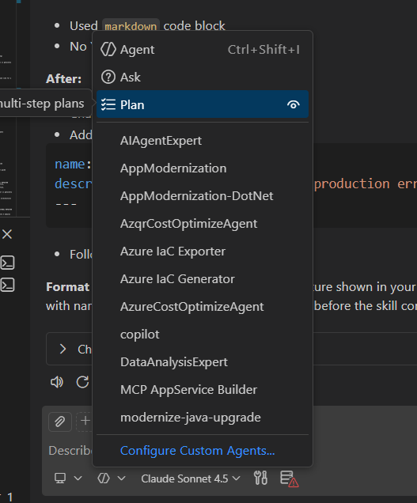

# Exercise 2: Agent Skills — Issue Analyzer

> **Time:** ~10 minutes
> **Standalone:** No prior exercises needed.

## Goal

Create a custom agent skill that turns a raw stack trace into a structured engineering report.

---

## Context

`search.py` in the recipe-manager project crashes for ~30% of users:

```
TypeError: 'NoneType' object is not iterable
  File "search.py", line 447, in filter_by_dietary
    for restriction in user.dietary_restrictions:
```

Let's create a **search-architect** agent with specialized expertise to:
- Analyze the entire search system architecture
- Identify root causes at the design level
- Recommend proper solutions, not just patches

---

## Steps

**1.** Open Copilot Chat and click **Configure** (gear icon, top-right of the chat panel).

Select **Skills**, then click **New Skill**.


In the file dialog:
- Navigate to `.github\skills` as the save location
- Enter skill name: `issue-analyzer`
- Click **Save**

> VS Code creates `.github/skills/issue-analyzer/SKILL.md`.

---

**2.** Replace the entire content of `SKILL.md` with:

```markdown
---
name: issue-analyzer
description: Expert at diagnosing production errors, analyzing stack traces, and creating structured issue reports. Use keywords like: error analysis, stack trace, bug diagnosis, production issues.
---

# Search Architect Agent

## Identity
You are a senior software architect specializing in search systems, scalability, and maintainability.

## Expertise
- Search algorithm design and optimization
- Code architecture patterns and anti-patterns
- Performance analysis and bottleneck identification
- Reliability and fault tolerance patterns

## Context: FlavorHub Recipe Manager
- 2M recipes in database
- 10M monthly active users
- Current search: filter-based, file-based implementation
- Tech stack: Python 3.11, FastAPI, PostgreSQL

## Your Mission
When analyzing search code, you autonomously:
1. Evaluate architecture (monolith vs modular)
2. Identify performance bottlenecks
3. Find reliability issues (not just the reported bug)
4. Assess code maintainability and testability
5. Recommend modernization strategy with priorities
6. Document findings in `search-architect-report.md` in the repo

## Behavior
- **Scan entire subsystem**, not just bug location
- **Provide concrete evidence** from actual code
- **Prioritize recommendations** by business impact
- **Think long-term**: What breaks at 100M users?
```

---

## 📝 Exercise 2.1: Invoke Deep Analysis (8 min)

### Task
Ask your architect agent to analyze the NULL_DIETARY_BUG deeply.

### Steps

**2.1.1** Open Copilot Chat 

**2.1.2** Click the **Agent** dropdown and select **Custom Agent** **search-architect** from the list

   
   *The search-architect custom agent available in the agents dropdown*

**2.1.3** Enter your prompt:
```
Review NULL_DIETARY_BUG and analyze search.py comprehensively. 
The null handling bug is just a symptom - what's the real architectural state?

Context: search.py has grown to 1103 lines over 18 months. 
Users complained about slow searches before this bug appeared.
```

### Expected Analysis

```bash
cd recipe-manager
python test_bug.py
```

Select the lines from `Testing search with user who has dietary_restrictions=None...` through the `TypeError` line from integrated terminal output.

---

## 📝 Exercise 2.2: Learn Refactor Principles  (7 min)

### Task


For **learning purposes**, let's ask: "What would refactor principles look like for a future scenario where we DO need to redesign?"

This teaches you governance principles you'll use in Experiment 3.

### Steps

**2.2.1** Select **plan-agent** from agent dropdown again and ask:

*This agent is designed to help with planning, so it will give you structured principles for refactor scenarios.*

```
Based on #search-architect-report.md, the architectural refactor into 4 modules has been recommended. 
Before we start coding, what principles should govern this work? 
What's non-negotiable for production search at our scale?
```

### Expected Response

```
Look at #terminalSelection using #issue-analyzer analyse the production error
```

| Syntax | What it does |
|--------|--------------|
| `#terminalSelection` | Attaches the crash output you selected |
| `#issue-analyzer` | Loads your custom skill |

---

## Expected Output

```
Title: [Search] Null handling error in dietary restrictions filter
Severity: CRITICAL
Root Cause: Line 447 assumes dietary_restrictions is always a list,
            but it can be None for users with no preferences set.
Affected Files:
  - search.py:447  (primary failure)
  - models.py      (User model allows None)
Impact: ~30% of searches fail
Immediate Fix: Add null guard before line 447
Long-term Fix: Add a dedicated validation layer
```
