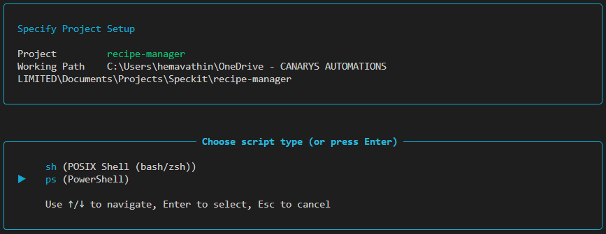
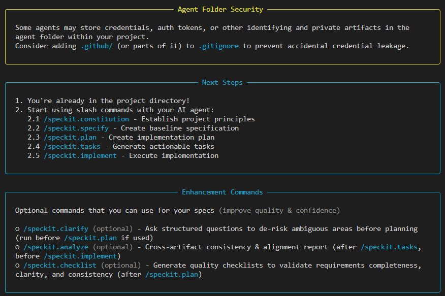

# Exercise 2: Spec Kit Setup

> **Time:** ~5 minutes
> **Standalone:** No prior exercises needed.
> **Track:** 🟢 Mandatory — Required for Exercises 3, 4, and 5

---

> **Note for participants:** This is a required setup exercise. Exercises 5, 6, and 7 all depend on Spec Kit being installed. Complete this before moving to any of those exercises.

---

## Goal

Install the Spec Kit CLI and initialize it in the `recipe-manager` project so the `/speckit.*` slash commands are available in Copilot Chat.

---
## Context
Spec Kit is a powerful tool for defining software specifications, creating implementation plans, and ensuring code quality. In this exercise, you'll set up Spec Kit in the existing `recipe-manager` project to prepare for the upcoming refactoring work.

---
## Steps

**1.** Install `uv` (required to install Spec Kit):

```bash
# Windows — run in PowerShell
winget install astral-sh.uv

# macOS / Linux
curl -LsSf https://astral.sh/uv/install.sh | sh
```
After installation, you may need to restart your terminal or add `uv` to your PATH. Verify installation:

```bash
uv --version
```

---

**2.** Install Spec Kit:

```bash
uv tool install specify-cli --from git+https://github.com/github/spec-kit.git
```

---

**3.** Initialize Spec Kit in the project:


```bash
specify init --here
```

When prompted *"Initialize Spec Kit in existing repository?"*, type **yes**.



---

**4.** Open Copilot Chat and type `/spec` to verify the commands appear:

**Essential commands for the Spec-Driven Development workflow:**

| Command | Description |
|---------|-------------|
| `/speckit.constitution` | Create or update project governing principles and development guidelines |
| `/speckit.specify` | Define what you want to build (requirements and user stories) |
| `/speckit.plan` | Create technical implementation plans with your chosen tech stack |
| `/speckit.tasks` | Generate actionable task lists for implementation |
| `/speckit.implement` | Execute all tasks to build the feature according to the plan |

**Optional Commands**

Additional commands for enhanced quality and validation:

| Command | Description |
|---------|-------------|
| `/speckit.clarify` | Clarify underspecified areas (recommended before `/speckit.plan`; formerly `/quizme`) |
| `/speckit.analyze` | Cross-artifact consistency & coverage analysis (run after `/speckit.tasks`, before `/speckit.implement`) |
| `/speckit.checklist` | Generate custom quality checklists that validate requirements completeness, clarity, and consistency (like "unit tests for English") |



---
## What you did
|Item|Description|
|----|-----------|
| Spec Kit Installation | You installed the Spec Kit CLI using `uv`. |
| Project Initialization | You initialized Spec Kit in the `recipe-manager` project. |
| Slash Commands | The `/speckit.*` commands are now available in Copilot Chat. |


