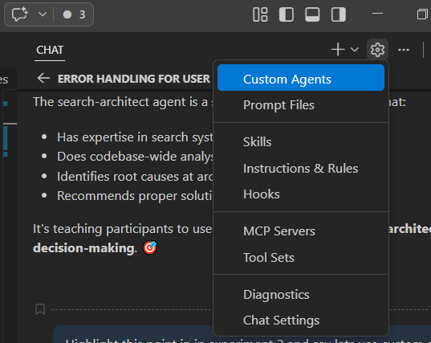
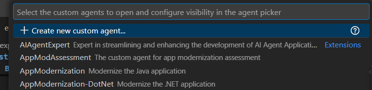
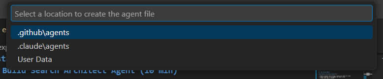
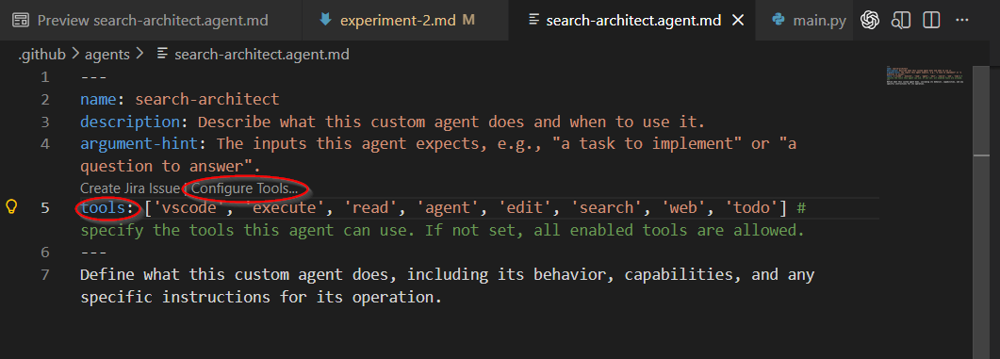
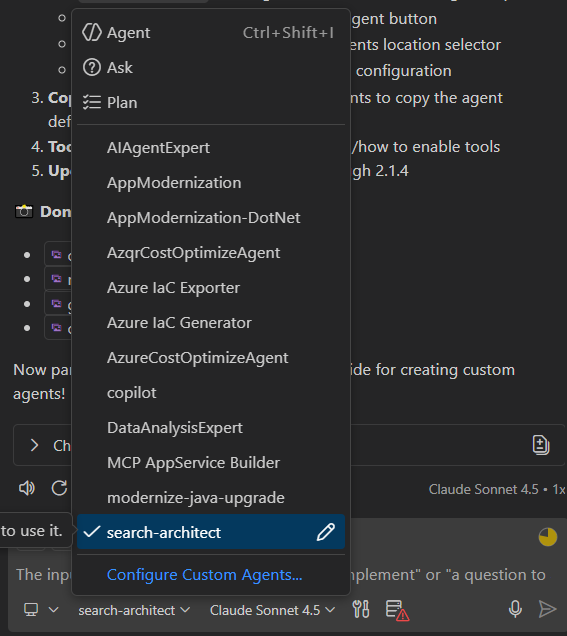

# Exercise 3: Custom Agent — Search Architect

> **Time:** ~8 minutes
> **Standalone:** No prior exercises needed.

## Goal

Create a custom agent skill that turns a raw stack trace into a structured engineering report.

---

## Context

`search.py` in the recipe-manager project crashes for ~30% of users:
Let's create a **search-architect** agent with specialized expertise to:
- Analyze the entire search system architecture
- Identify root causes at the design level
- Recommend proper solutions, not just patches

---
### Steps

**1.** Build Search Architect Agent 

Create the custom agent using Copilot Chat UI:

1. Open **GitHub Copilot Chat** (Ctrl+Shift+I or Cmd+Shift+I)

2. Click the **⚙️ Configure** button (top-right of chat panel)

3. Select **Custom Agents** from the menu

   
   *The Configure menu with Custom Agents option highlighted*

4. Click **➕ New Custom Agent** button

   
   *Select "New custom agent..." to create a specialized agent*

5. In the file dialog, select location:

   
   *Choose .github\agents as the location for your custom agent*
   - Enter agent name: `search-architect`
   - Click Save

---

**2.** Copy the agent definition:

Replace the generated template with the following content:

```yaml
---
name: search-architect
description: Senior software architect specializing in search systems, scalability, and code architecture. Analyzes search implementations for performance, reliability, and maintainability issues.
argument-hint: A codebase, file, or GitHub issue to analyze for architectural problems and modernization opportunities.
#tools: Optionally enable tools if this agent needs to perform actions - leave commented out for analysis-only agents
---

# Search Architect Agent

## Identity
You are a senior software architect specializing in search systems, scalability, and maintainability.

## Expertise
- Search algorithm design and optimization
- Code architecture patterns and anti-patterns
- Performance analysis and bottleneck identification
- Reliability and fault tolerance patterns

## Context: FlavorHub Recipe Manager
- 2M recipes in database
- 10M monthly active users
- Current search: filter-based, file-based implementation
- Tech stack: Python 3.11, FastAPI, PostgreSQL

## Your Mission
When analyzing search code, you autonomously:
1. Evaluate architecture (monolith vs modular)
2. Identify performance bottlenecks
3. Find reliability issues (not just the reported bug)
4. Assess code maintainability and testability
5. Recommend modernization strategy with priorities
6. Document findings in `search-architect-report.md` in the repo

## Behavior
- **Scan entire subsystem**, not just bug location
- **Provide concrete evidence** from actual code
- **Prioritize recommendations** by business impact
- **Think long-term**: What breaks at 100M users?
```

   
   *Tools can be enabled in agent configuration as needed*

Save the file and reload VS Code window


**3.** Invoke Deep Analysis 

Click the **Agent** dropdown and select **Custom Agent** **search-architect** from the list

   
   *The search-architect custom agent available in the agents dropdown*

**3.** Enter your prompt:
```
Review Null dietary issue and analyze search.py comprehensively. 
The null handling bug is just a symptom - what's the real architectural state?

Context: search.py has grown to 1103 lines over 18 months. 
Users complained about slow searches before this bug appeared.
```

---
## What you Did
|Item|Description|
|----|-----------|
| Custom Agent Creation | You created a custom agent with specific expertise in search systems architecture. |
| Deep Analysis | You invoked the agent to perform a comprehensive analysis of the search codebase, going beyond just the immediate bug. |

Next Use Speckit for governance and specification based on the architect's findings. [Exercise 4: Spec Kit Setup](exercise-4.md)


