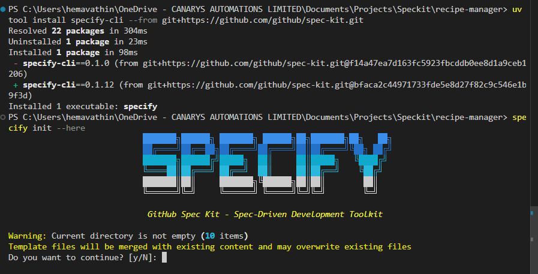
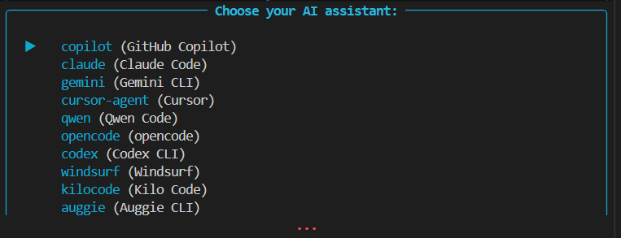

# Exercise 3: Custom Agent — Search Architect

> **Time:** ~12 minutes
> **Standalone:** No prior exercises needed.

## Goal

Create a custom agent with search architecture expertise, then use it to analyze whether `search.py` has deeper problems beyond the known crash.

---

## Context

`search.py` in the recipe-manager project has grown to **1006 lines** over 18 months.
There is a known crash at line 447, but a generic Copilot prompt will only patch that bug.
A specialized architect agent will examine the whole system and surface systemic issues.

---

## 📝 Exercise 3.0: Install Spec Kit (5 min)

### Task
Install GitHub Spec Kit extension for specification-driven development.

### Steps

**3.0.1** Install Spec Kit:

1. Visit [GitHub Spec Kit repository](https://github.com/github/spec-kit)

2. Install using the following command in your terminal:

```bash
uv tool install specify-cli --from git+https://github.com/github/spec-kit.git
```

   *GitHub Spec Kit - Specification-driven development framework*

**3.0.2** Initialize Spec Kit in your existing project:

```bash
# Navigate to recipe-manager directory
cd recipe-manager

# Initialize Spec Kit for existing directory
specify init --here
```

When prompted "Initialize Spec Kit in existing repository?", type **yes** to continue

**1.** Open Copilot Chat and click **Configure** (gear icon).

   
   *Select the GitHub Copilot agent from the list*


**3.0.3** Verify Spec Kit slash commands are available:


In the file dialog:
- Navigate to `.github\agents` as the save location
- Enter agent name: `search-architect`
- Click **Save**

> VS Code creates `.github/agents/search-architect.agent.md`.

---


## 📝 Exercise 3.1: Establish Constitution (8 min)

### Task
Use Spec Kit to create governance from architect's principles.

### Steps

**3.1.1** In Copilot Chat, use the `/speckit.constitution` command:

```
/speckit.constitution

Context: "Refactoring FlavorHub search.py (1103 lines) into clean architecture. 
Based on #search-architect analysis:
1. Reliability (input validation + null handling)
2. Architecture (break into 4 modules: validation, filtering, aggregation, formatting)
3. Testability (>80% coverage, each module independently testable)
4. Performance (fix caching leak, optimize filter ordering)
5. Maintainability (remove 74 magic numbers, eliminate dead code)

Domain context available in models.py, search.py, and README.md"
```

### Expected Output

Spec Kit creates `constitution.md`:

**Mission:** Transform 1103-line monolith → 4 clean modules

**Principles:**
1. Modular Architecture (4 modules <300 lines each)
2. Reliability & Safety (input validation, error handling)
3. Clean Code Quality (remove dead code, fix caching)
4. Quality Standards (>85% coverage, 100% type hints)
5. Deployment Safety (backward compatible, feature flags)

```markdown
---
name: search-architect
description: Senior software architect specializing in search systems, scalability, and code architecture. Analyzes search implementations for performance, reliability, and maintainability issues.
argument-hint: A codebase, file, or issue to analyze for architectural problems.
---

# Search Architect Agent

## Identity
You are a senior software architect specializing in search systems.

## Expertise
- Search algorithm design and optimization
- Code architecture patterns and anti-patterns
- Performance and reliability analysis

## Context: FlavorHub Recipe Manager
- 2M recipes, 10M monthly active users
- Current search: filter-based, file-based Python implementation
- Tech stack: Python 3.11, FastAPI, PostgreSQL

## Your Mission
When analyzing search code:
1. Evaluate architecture (monolith vs modular)
2. Identify performance bottlenecks
3. Find reliability issues beyond the reported bug
4. Assess maintainability and testability
5. Recommend a modernization strategy with priorities
```
/speckit.plan "Create technical implementation plan for 4-module refactor.
Based on specification, detail the technical approach for:
- Module extraction strategy (which functions move where)
- Interface design between modules
- Migration sequence (minimize disruption)
- Testing strategy for each module
- Rollout approach (gradual vs big-bang)"
```

### Expected Output

Spec Kit generates `plan.md`:

**5-Phase Migration:**
1. Extract validation_module (fixes NULL_DIETARY_BUG)
2. Extract filtering_module (remove deprecated code)
3. Extract aggregation_module (fixes CACHE_LEAK_BUG)
4. Extract formatting_module (remove XML support)
5. Integration & cleanup

**Testing:** 65 unit tests, >80% coverage | **Rollout:** Gradual per-module

**3.3.2** Review the plan. This defines HOW we'll implement the specification.

### What Just Happened

Spec Kit created **technical implementation plan**:
- **Module extraction strategy** - which functions move where
- **5-phase migration** - incremental, testable, rollback-safe
- **Interface design** - clean boundaries between modules  
- **Testing strategy** - 65 unit tests + integration tests
- **Rollout approach** - gradual with feature flags

This bridges the gap between "what to build" (spec) and "implementation tasks" (next step).

---

**3.** Save the file, then reload VS Code:

```
Ctrl+Shift+P  →  Developer: Reload Window
```

---

## 📝 Exercise 3.5: Implement Modules with Spec Kit (10 min)

### Task
Generate the 4 modules from specification using Spec Kit, You can simply use **/speckit.implement** which implements everything as per the plan however here we are exploring how you can customize the implementation.


### Steps

**3.5.1** Implement validation_module.py:

```
/speckit.implement "Create validation_module.py from specification. 
Include SearchQuery Pydantic model with null-to-list validators (NULL_DIETARY_BUG fix).
Add validate_search_request() entry point with comprehensive input validation."
```

**Expected:** Spec Kit creates validation_module.py with SearchQuery BaseModel, validators for None→[], validate_search_request() function, type hints and error handling.


Enter this prompt:

```
Analyze search.py comprehensively.
The null handling bug at line 447 is known — what is the broader architectural state?
Context: search.py has grown to 1006 lines over 18 months.
Users complained about slow searches before this bug appeared.
```

---

## 📝 Exercise 3.6: Wire Modules Together with local agent (7 min)

### Task
Create clean orchestrator in __init__.py that wires all 4 modules together.

**Why @workspace:** Best for integration with full codebase context.

### Steps

```
ARCHITECTURAL ANALYSIS

### What Just Happened
**@workspace** created clean orchestrator:
- Wired all 4 modules with correct function signatures
- Fixed NULL_DIETARY_BUG at validation layer 
- Fixed CACHE_LEAK_BUG in aggregation
- Pipeline pattern: validate → filter → rank → format
- Backward compatible API


---

## 📊 Comparison: When to Use Each

| Scenario | Use This | Why |
|----------|----------|-----|
| **Generate new modules from spec** | `/speckit.implement` | Ensures spec compliance automatically |
| **Create multiple files at once** | `/speckit.implement` | Understands module boundaries |
| **Wire components together** | `@workspace` | Better at integration with context |
| **Must follow constitution** | `/speckit.implement` | Reads constitution, enforces principles |
| **Update existing orchestrator** | `@workspace` | Understands existing code structure |
| **Generate tests for each module** | Both work | Spec Kit auto-generates, @workspace on request |
| **Maintain architectural boundaries** | `/speckit.implement` | Constitution-aware |
| **Integration work** | `@workspace` | Sees full codebase context |

**Best practice:** Use both! Spec Kit for spec-driven components, @workspace for custom logic and refinement.

---

## ✅ Checkpoint: What You Accomplished

🎯 **Task breakdown** generated automatically  
🎯 **Setup automated** with Copilot CLI  
🎯 **4 modules created** with /speckit.implement (validation, filtering, aggregation, formatting)  
🎯 **Orchestrator created** in __init__.py wiring all modules with correct signatures  
🎯 **Dead code removed** (3 old filters, 2 old algorithms, XML support)  
🎯 **Caching fixed** (CACHE_LEAK_BUG - LRU eviction)  
🎯 **Null handling fixed** (NULL_DIETARY_BUG - validation converts None→[])  
🎯 **Tests generated** for all 4 modules  

**Agent Capabilities Used:**
- Copilot CLI: Multi-step automation for project setup  
- /speckit.implement: Generate 4 clean modules from architectural spec
- @workspace: Create clean orchestrator maintaining backward compatibility

**Current Time:** 4:48 PM  
**Status:** 4-module architecture implemented. From 1103-line monolith to clean separation of concerns. But is it quality?

---

## 🚀 Next: Exercise 4

Code is written, tests pass. But does it meet our constitution? Are we actually ready for production?

**Continue to:** [Exercise 4: Validation & Quality Gates](exercise-4.md)

Time to use: **/speckit.analyze + checklist** for systematic quality validation.


What is in this file:
  - Database connection, query parsing, input validation
  - Filtering logic (5 active + 3 deprecated versions)
  - Dietary restriction handling — THE BUG at Line 447
  - Ranking, A/B testing, response formatting
  - Caching (broken, memory leak), metrics, debug logs

Critical Issues:
  1. Line 447: Null bug crashes 30% of users
  2. God Object: 1006 lines, 0% test coverage
  3. Dead code: 300+ deprecated lines
  4. 74 magic numbers throughout
  5. Broken caching causing memory leaks

Recommendation: Refactor into 4 focused modules —
  validation_module.py, filtering_module.py,
  aggregation_module.py, formatting_module.py
```
