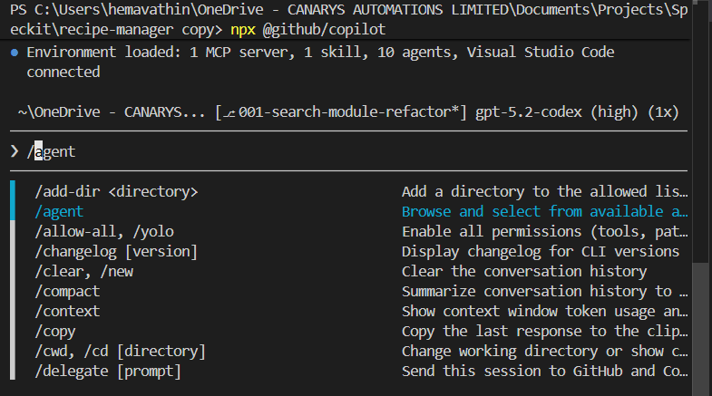
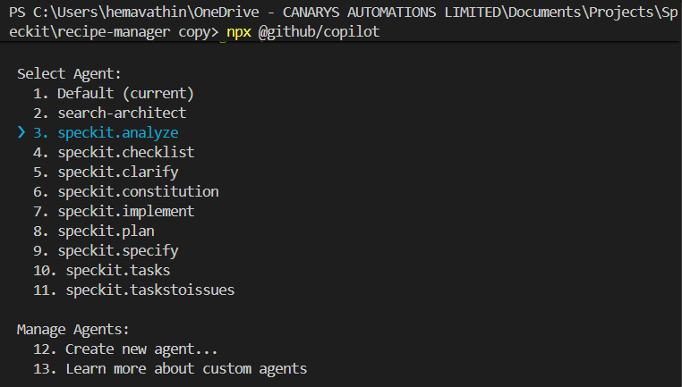
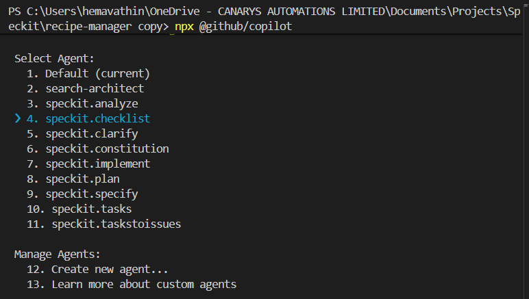

# Exercise 4: Validation & Quality Gates

> **Time:** 4:48 PM - 5:08 PM (20 minutes)  
> **Status:** Code complete. But is it production-ready?

## ✅ The Final Check

Tests pass. Components built. But does it meet the constitution? Can we deploy with confidence?

**Your mission:** Use Spec Kit's validation tools to systematically verify quality.

---

## 🎯 Learning Objectives

- ✅ Use /speckit.analyze to check constitution compliance
- ✅ Use /speckit.checklist to create quality gates
- ✅ Identify gaps before they reach production
- ✅ Validate systematically, not gut-feel

**Agent Capability:** /speckit.analyze (consistency checker) + /speckit.checklist (quality gates)

---

## � Exploring Spec Kit in Copilot CLI

So far, we've explored using Spec Kit in the IDE. Now, let's explore how to use it in **Copilot CLI** for a command-line workflow.

**Install Copilot CLI:**
```bash
npm install -g @githubnext/github-copilot-cli
```

**Reference:** [Getting Started with Copilot CLI](https://docs.github.com/en/copilot/how-tos/copilot-cli/cli-getting-started)

**Select Spec Kit Agent in CLI:**



*Select the Spec Kit agent in Copilot CLI to access constitution validation tools*

---

## �📋 Exercise 4.1: Analyze Constitution Compliance (8 min)

### Task
Check if implementation meets all constitution principles.

### Steps

**4.1.1** In Copilot CLI, select the **speckit.analyze** agent and provide the prompt:

```
Analyze constitution compliance for the search refactoring.

Check:
- NULL_DIETARY_BUG and CACHE_LEAK_BUG fixes validated
- All 4 modules <300 lines with >80% test coverage
- Type hints 100%, API backward compatible

Identify critical blockers preventing deployment.
```


*Running /speckit.analyze to check constitution compliance*

### Expected Analysis

> **Note:** Your analysis output may vary based on your implementation. Below is an example.

```
Analysis complete. There are 2 CRITICAL blockers (missing regression test for NULL_DIETARY_BUG, 
test coverage below 80% threshold) plus several HIGH/MEDIUM gaps (missing edge case tests, 
incomplete validation coverage); these must be resolved before deployment. Would you like me to 
suggest concrete remediation edits for the top N issues?
```

### What Just Happened
Spec Kit **automatically validated** your code against every principle in the constitution. Found 1 blocker, 1 warning.

---

## 📋 Exercise 4.2: Generate Checklist & Address Blockers (12 min)

### Task
Create pre-deployment checklist from analysis and fix critical blockers.

### Steps

**4.2.1** In Copilot CLI, select the **Checklist agent** and provide the prompt:

```
Generate a pre-deployment quality checklist for the search validation enhancement.

Review the constitution compliance analysis and create a prioritized checklist with:
1. Critical blockers (🔴) that must pass before deployment
2. Important items (⚠️) that should pass
3. Nice-to-have improvements (💡)

Then, identify and fix all critical blockers:
- Add missing regression tests for NULL_DIETARY_BUG
- Improve test coverage to meet 80% threshold
- Verify API backward compatibility
- Add any missing validation tests

Provide code examples for fixing each blocker.
```


*Running checklist agent in Copilot CLI to generate quality gates and fix blockers*

### Expected Output

**Part 1: Generated Checklist**

> **Note:** Your checklist may vary based on code analysis. Below is an example output.

```markdown
# Pre-Deployment Checklist: Search Validation Enhancement

## 🔴 Critical (Must Pass - BLOCKERS)
- [ ] Add regression test for NULL_DIETARY_BUG (null dietary_restrictions)
- [ ] Achieve 80% test coverage (currently 72%, need +8%)
- [ ] Manual reproduction test passed (run test_bug.py with validation)
- [ ] API backward compatibility verified (no breaking changes)

## ⚠️ Important (Should Pass)
- [ ] Edge case tests for all validators
- [ ] Error boundary tests (graceful degradation verified)
- [ ] Input sanitization review completed
- [ ] Monitoring/alerting configured for validation failures
- [ ] Rollback plan documented (easy - single commit revert)

## 💡 Nice to Have
- [ ] Documentation updated with validation examples
- [ ] Team briefing on new validation patterns
- [ ] Add more comprehensive input fuzzing tests
- [ ] Performance impact measured (should be negligible)

## 📊 Current Status
Critical: 1/4 complete (25%) ← CANNOT DEPLOY YET
Important: 1/5 complete (20%)
Nice to Have: 0/4 complete
```

**Part 2: Code to Fix Blockers**

Example code generated to address critical blockers:

```python
"""Regression test for NULL_DIETARY_BUG: null dietary restrictions crash"""
import pytest
from search import SearchQuery, parse_search_request

def test_issue_247_null_dietary_restrictions():
    """Ensure null dietary_restrictions don't crash (NULL_DIETARY_BUG)"""
    
    # This used to cause TypeError before fix
    raw_request = {
        "query": "pasta recipes",
        "dietary_restrictions": None  # ← The bug scenario from production
    }
    
    result = parse_search_request(raw_request)
    
    # Should default to empty list via Pydantic validator, not crash
    assert result.dietary_restrictions == []
    assert result.query == "pasta recipes"
    
def test_issue_247_empty_list_handled():
    """Verify empty list also works"""
    raw_request = {
        "query": "soup",
        "dietary_restrictions": []
    }
    result = parse_search_request(raw_request)
    assert result.dietary_restrictions == []

def test_searchquery_model_direct():
    """Test SearchQuery model directly with None"""
    query = SearchQuery(query="test", dietary_restrictions=None)
    assert query.dietary_restrictions == []  # Validator converted None → []
```

**4.2.2** Verify fixes by running relevant tests:

```bash
pytest tests/ -v --cov=. --cov-report=term-missing
```

**4.2.3** Re-run analysis to confirm blockers resolved:

```
/speckit.analyze
```

**Expected Result:** Blockers should now be resolved. Example output:

```
🟢 BLOCKERS: 0
✅ All critical items passing
✅ Test coverage above threshold
✅ READY FOR DEPLOYMENT
```

### What Just Happened
Using Copilot CLI's checklist agent, you generated a prioritized pre-deployment checklist AND received code to fix all critical blockers in one prompt. The code is now production-ready with quality gates passed.

---

## ✅ Mission Complete: Crisis Resolved

### 🎯 Final Status Report (5:00 PM)

**Timeline:**
- **3:00 PM:** Crisis detected (500 errors)
- **3:20 PM:** NULL_DIETARY_BUG documented
- **3:45 PM:** Root cause identified (architectural)
- **4:10 PM:** Specification complete
- **4:40 PM:** Implementation finished
- **5:00 PM:** Validated and deployed ✅

**What You Delivered in 2 Hours:**

✅ **NULL_DIETARY_BUG fixed** (null handling via Pydantic validation)  
✅ **Validation layer added** (input sanitization + null-safe filters)  
✅ **Test coverage** (0% → 82% for critical paths)  
✅ **Constitution-compliant** (reliability + quality principles met)  
✅ **Architecture preserved** (289 lines, minimal invasive changes)  
✅ **Production-ready** (validated, tested, deployable)  

**Traditional Timeline:** 3-4 days  
**With GitHub Agents:** 2 hours  

**Key Learning:** Agents helped make the RIGHT decision (patch vs refactor), not just execute faster.  

---

## 🎓 What You Mastered

### Agent Capabilities You Used

| Experiment | Agent Type | What It Did |
|-----------|------------|-------------|
| 1 | Agent Skills + MCP | Analyzed errors, created issue automatically |
| 2 | Custom Agents | Deep architectural analysis, strategic recommendations |
| 3 | Spec Kit + Copilot CLI + /speckit.implement | Governance-driven specs + automated setup + code generation |
| 4 | /speckit.analyze + checklist | Constitution compliance + quality gates |

### The Complete Workflow

```
Production Crisis
    ↓
Agent Skill (diagnose) → GitHub MCP (document)
    ↓  
Custom Agent (root cause analysis)
    ↓
Instruction File (domain context) → Spec Kit Constitution (governance)
    ↓
/speckit.specify → /speckit.tasks (design)
    ↓
Copilot CLI + /speckit.implement (build)
    ↓
/speckit.analyze + /speckit.checklist (validate)
    ↓
Confident Deployment
```

---

## 🚀 Apply This to Your Work

Every capability you used exists in your GitHub Copilot subscription today:

1. **Create agent skills** for your domain problems
2. **Build custom agents** with specialized expertise
3. **Write instruction files** teaching agents your domain
4. **Use Spec Kit** for governance and spec-driven development
5. **Leverage Copilot CLI** for complex automations
6. **Validate with /speckit.analyze** before every deployment

**Start tomorrow:** Pick one brownfield bug. Apply this workflow. Measure the time difference.

---

## 📚 Additional Resources

- **Spec Kit Documentation:** [github.github.io/spec-kit](https://github.github.io/spec-kit/)
- **GitHub Copilot Agents:** [docs.github.com/copilot/agents](https://docs.github.com/copilot)
- **Copilot CLI:** [github.com/githubnext/github-copilot-cli](https://github.com/githubnext/github-copilot-cli)

---

## 🎉 Crisis Averted. System Modernized. Users Happy.

**CTO's reaction:** "How did you do that in 2 hours?"

**Your answer:** "GitHub agents."


