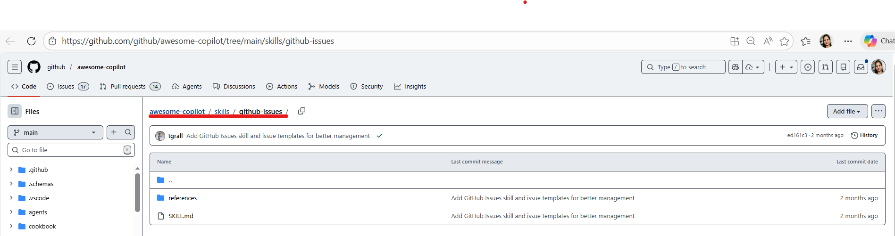
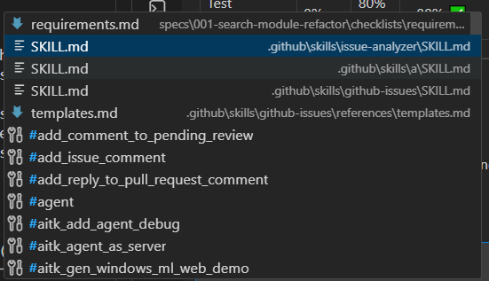
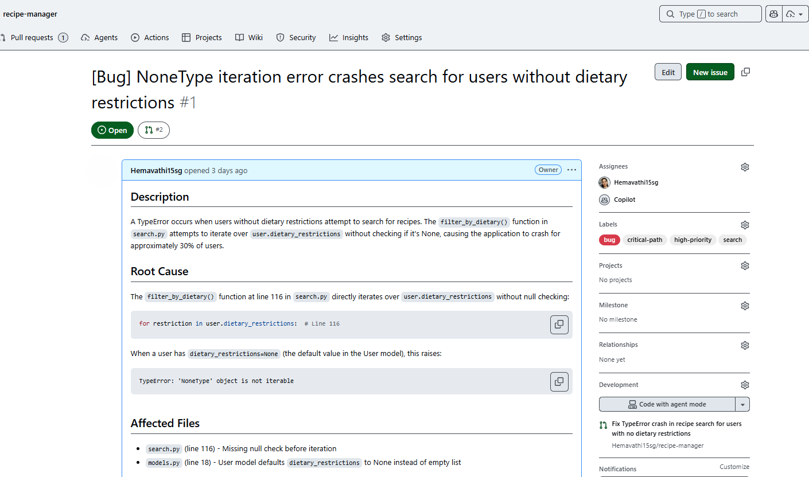

# Exercise 8: Agent Skills — GitHub MCP

> **Time:** ~7 minutes
> **Standalone:** No prior exercises needed.
> **Track:** 🟡 Optional — Standalone

---

> **Note for participants:** This exercise is fully self-contained and has no dependencies on other exercises. Complete it any time — before, after, or between the mandatory exercises. Skip it if time is short and return later.

---

## Goal
Use GitHub MCP to create a well-formatted issue directly from an analysis, and assign it to the copilot for resolution.

---

## Context

Issue details from Excercise 1 are in hand. Now, let's use GitHub MCP to create a well-formatted issue directly from our analysis, and assign it to the copilot for resolution.

---
## Steps

**1.** Add the GitHub Issues skill from the community library:

1. Visit [GitHub's Awesome Copilot Skills Library](https://github.com/github/awesome-copilot/tree/main/skills/github-issues)

   

<br />
*GitHub's official skills library with community-contributed skills*

2. Create the `github-issues` skill folder structure in your repo inside VS Code or terminal with the following command:
   ```bash
   mkdir -p .github/skills/github-issues/references
   ```

3. Copy the official SKILL.md from GitHub:
   - Navigate to the `github-issues` skill in the [Awesome Copilot Skills repository](https://github.com/github/awesome-copilot/blob/main/skills/github-issues/SKILL.md)
   - Click **Raw** button to view the raw markdown
   - Copy the entire content
   - Paste into your `.github/skills/github-issues/SKILL.md` file (VS Code → File Explorer → .github → skills → github-issues → New File → SKILL.md)
   - Save the file

4. Copy the reference template:
   - Navigate to [issue-template.md](https://github.com/github/awesome-copilot/blob/main/skills/github-issues/references/templates.md) in the same repository
   - Click **Raw** button
   - Copy the entire content
   - Paste into your `.github/skills/github-issues/references/templates.md` file (VS Code → File Explorer → .github → skills → github-issues → references → New File → templates.md)
   - Save the file
---

**2.** In Copilot Chat, create the issue and assign to Copilot:

**Note** When you run the below command, use **#** it refers to list of folders/files so select the appropriate one from the dropdown. 

   

*GitHub's official skills library with community-contributed skills*
```
Create a GitHub issue based on the #file:issue-analyzer analysis, Use #file:github-issues format and use #mcp_github_assign_copilot_to_issue to fix the issue.
```


*Issue created with proper formatting and automatically assigned to @copilot*


---

## What you Did
| Item | Detail |
|------|--------|     
| Skill Creation | Used a custom skill from skills library |
| GitHub MCP | Used GitHub MCP to create and assign an issue based on the analysis |  


